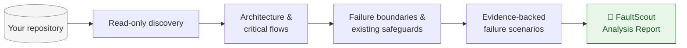
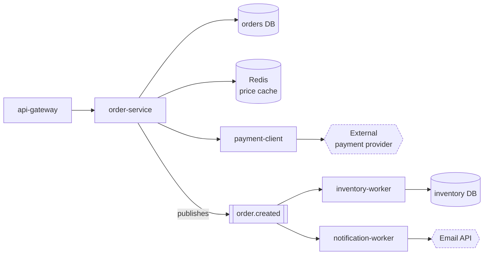
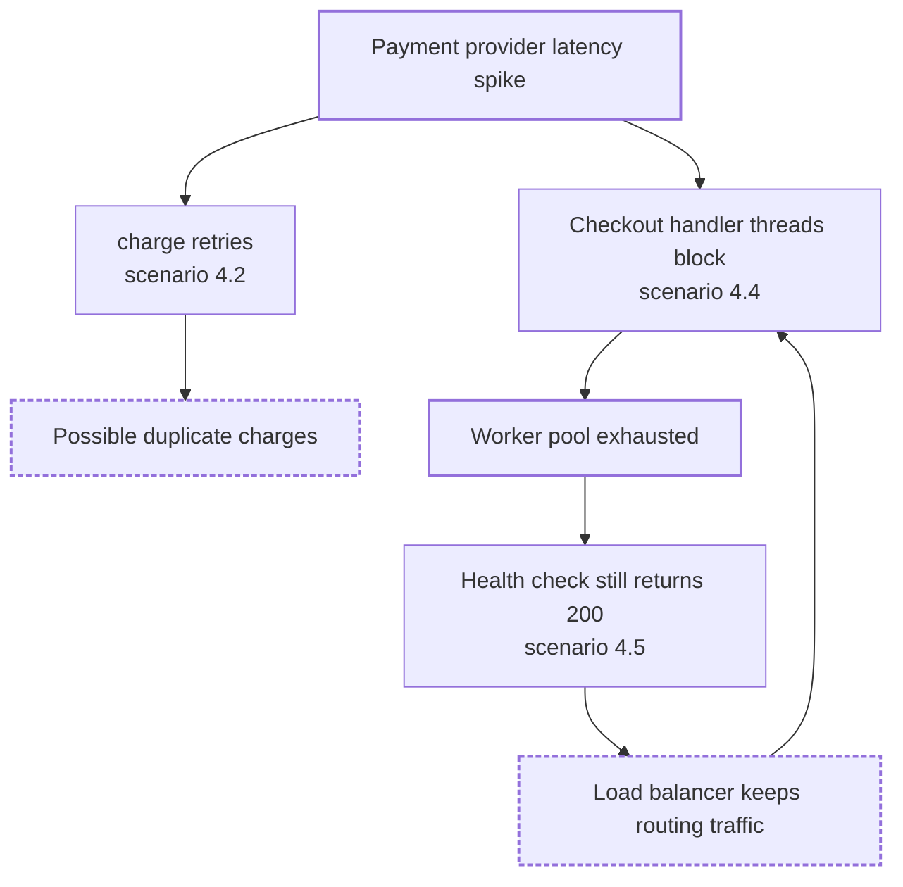
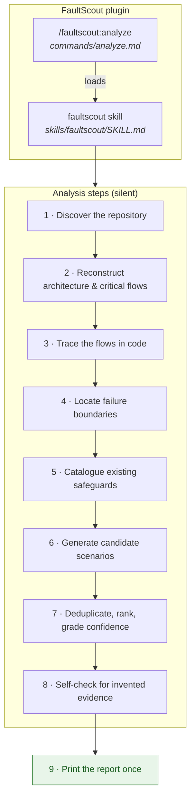
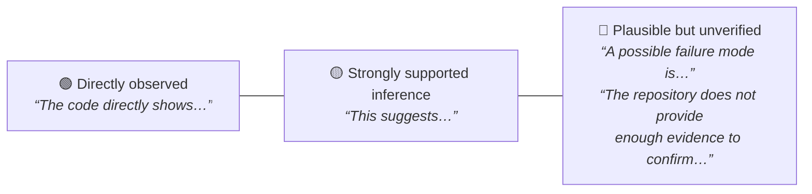

<div align="center">

# 🔍 FaultScout

**Discover how your software system can fail — before production does.**

A [Claude Code](https://claude.com/claude-code) plugin that reads your repository and reports
evidence-backed failure scenarios. Read-only. No runtime. No guessing.

[](#-installation)
[](#-roadmap)
[](LICENSE)
[](#-safety-boundaries)
[](CONTRIBUTING.md)

[Installation](#-installation) ·
[Quick start](#-quick-start) ·
[Example output](#-example-output) ·
[How it works](#-how-it-works) ·
[Safety boundaries](#-safety-boundaries) ·
[Contributing](#-contributing)

</div>

---

## What is FaultScout?

You open Claude Code inside a repository, type one command, and FaultScout:

1. **reads** the code, configuration, and infrastructure files,
2. **reconstructs** the architecture and the critical request / data / event flows,
3. **locates** the boundaries where things can break — timeouts, retries, partial
   writes, stale caches, races, duplicate events, resource limits,
4. **reports** the strongest failure scenarios, each tied to real files, functions,
   and configuration keys, with an honest statement of how strong the evidence is.



It is not generic reliability advice. If the evidence is not in the repository,
FaultScout says so instead of inventing it.

> **FaultScout never runs your system, injects failures, or touches infrastructure.**
> Every scenario is a static hypothesis, never a runtime result.

---

## ✨ Why FaultScout?

| Traditional approach | FaultScout |
|---|---|
| Chaos experiments need a running environment, approvals, and blast-radius control | Works on a fresh checkout — no environment, no credentials, no risk |
| Generic checklists ("add retries, add timeouts") don't know *your* code | Every scenario cites *your* files, functions, and config keys |
| Reviews find bugs one function at a time | Traces how a failure **propagates** across services, queues, and stores |
| Reports mix guesses with facts | Three explicit certainty levels and a static confidence grade on every scenario |
| Tools that modify or run your repo need trust | Analysis-only by design; the plugin contains no executable code at all |

---

## 📦 Installation

FaultScout is distributed through the Claude Code plugin system. The repository is
its own plugin marketplace, so it installs straight from GitHub.

**Inside Claude Code:**

```text
/plugin marketplace add gofabric/fault-scout
/plugin install faultscout@faultscout
```

**Or from your shell:**

```bash
claude plugin marketplace add gofabric/fault-scout
claude plugin install faultscout@faultscout
```

Restart Claude Code (or start a new session) after installing.

**To update later:**

```text
/plugin marketplace update faultscout
/plugin update faultscout@faultscout
```

<details>
<summary><b>GitHub install vs. local development</b></summary>

| | GitHub install | Local development |
|---|---|---|
| How | `marketplace add` + `plugin install` | `claude --plugin-dir /path/to/fault-scout` |
| Where the files live | Copied into Claude Code's plugin cache | Read from your checkout on every start |
| Edits to the plugin | Need `plugin update` | Take effect on the next session |
| Scope | Persists across sessions | Only the session started with the flag |
| For | Using FaultScout | Working on FaultScout |

The command name is the same in both cases.

</details>

---

## 🚀 Quick start

Open Claude Code in the repository you want to analyze and run:

```text
/faultscout:analyze
```

That's it. Claude works silently through discovery, tracing, and ranking, then
prints a single **FaultScout Analysis Report** in the chat.

Want the report in another language?

```text
/faultscout:analyze language=turkish
```

| Command | Report language |
|---|---|
| `/faultscout:analyze` | English (default) |
| `/faultscout:analyze language=english` | English |
| `/faultscout:analyze language=turkish` | Turkish |

Only the human-readable prose is translated. File paths, symbols, configuration
keys, queue and table names, log messages, and code snippets are always quoted
exactly as they appear in your repository. An unsupported value stops before any
analysis begins:

```text
/faultscout:analyze language=spanish

Unsupported language: spanish.
Supported languages: english, turkish.
```

---

## 📄 Example output

Below is an **illustrative excerpt** from a report on a fictional e-commerce
checkout system. It is not real output from any repository — it shows the shape,
tone, and level of detail you get.

<details open>
<summary><b>Architecture the analysis reconstructed (section 3)</b></summary>



</details>

<details open>
<summary><b>One failure scenario (section 4)</b></summary>

> ### 4.2. Payment confirmation retried without an idempotency key
>
> **Summary:** A slow payment provider can cause the checkout handler to retry the
> charge call, and nothing in the repository prevents the provider from receiving
> the same charge twice.
>
> **Trigger condition:** The payment provider responds slower than the 2-second
> client timeout during a burst of checkouts.
>
> **Affected component:** `order-service` → `payment-client`
>
> **Evidence:**
>
> - `services/order/checkout_handler.py` — `confirm_order()` (lines 41–88)
> - `services/order/payment_client.py` — `charge()` (lines 12–37)
> - `config/order-service.yaml` — `payment.timeout_seconds`, `payment.max_retries`
>
> The code directly shows that `charge()` is wrapped in a retry loop with
> `max_retries: 3` and a fixed 2-second timeout, and that the request body carries
> no idempotency or request identifier. The repository does not provide enough
> evidence to confirm whether the provider deduplicates on its side.
>
> **Failure mechanism:** A timed-out request may still have been processed by the
> provider. The retry re-sends the same charge with no key the provider could use
> to recognize it as a duplicate.
>
> **Failure propagation path:**
>
> ```text
> payment provider latency > 2 s
>   ↓
> charge() times out; retry loop re-sends the request
>   ↓
> provider may process both the original and the retried charge
>   ↓
> confirm_order() records one order with one payment reference
>   ↓
> customer may be charged twice with no record in the orders DB
> ```
>
> **Potential consequences:** Duplicate customer charges, refund workload, and a
> reconciliation gap between the provider's ledger and `orders`.
>
> **Existing mitigations:** Bounded retry count and a per-request timeout
> (`config/order-service.yaml`).
>
> **Missing or questionable mitigations:** No idempotency key on the charge
> request; no check of provider-side transaction state before retrying; retries
> use a fixed delay with no jitter.
>
> **Static confidence:** HIGH — the retry loop, timeout, and request shape are all
> directly visible in the code and configuration.
>
> **Suggested follow-up:** Confirm with the provider's API documentation whether
> an idempotency header is supported; add an integration test that simulates a
> timeout after a successful charge.
>
> **Evidence limitations:** Provider-side deduplication behavior and real-world
> latency distribution are outside the repository.

</details>

<details>
<summary><b>How failures compound (section 5)</b></summary>



</details>

Every real report follows the same nine-section structure:

```text
# FaultScout Analysis Report
## 1. Executive Summary
## 2. Repository Overview
## 3. Architecture and Critical Flows
## 4. Failure Scenarios
## 5. Failure Propagation Paths
## 6. Existing Resilience Mechanisms
## 7. Potential Reliability Gaps
## 8. Recommended Follow-Up Actions
## 9. Evidence and Limitations
```

---

## ⚙️ How it works

FaultScout is **pure Claude Code instructions** — a command and a skill. There is
no server, no build step, no dependencies, and no runtime code. Claude Code already
provides file reading, search, and Git access; FaultScout only tells Claude how to
use them for reliability analysis.



### What it looks for

| Failure class | Examples |
|---|---|
| **Dependency outages** | database, cache, broker, external API, or internal service unavailable |
| **Timeouts** | missing, unbounded, or mismatched across a call chain |
| **Retries & retry storms** | unbounded retries, no backoff or jitter, retries that repeat side effects |
| **Missing safeguards** | no circuit breaker, bulkhead, fallback, or rate limit at a boundary |
| **Partial writes** | non-transactional multi-step updates, publish-before-commit |
| **Stale cache** | no invalidation path, TTL mismatches, cache-aside races |
| **Race conditions** | check-then-act without locking, concurrent updates to shared state |
| **Duplicate processing** | at-least-once delivery without idempotency |
| **Event delivery failures** | ack ordering, missing dead-letter handling, lost or reordered events |
| **Startup failures** | hard dependencies at boot, missing configuration, migration ordering |
| **Resource exhaustion** | connection pools, queues, threads, memory, file handles |
| **Recovery problems** | reconnect logic, poison messages, graceful shutdown |

A class appears in the report **only when the repository supports it**. FaultScout
never invents a scenario to fill a category.

### Three levels of certainty

Every claim is labelled so you know how much to trust it:



Two symmetric rules keep the analysis honest:

- A **missing safeguard is a gap, not a proven bug.**
- An **unobserved failure is not an impossible one.**

### Static confidence

Confidence describes the **quality of the static evidence** — never the probability
that a failure occurs, and never its severity.

| Grade | Meaning |
|---|---|
| `HIGH` | Directly supported by clear code or configuration evidence |
| `MEDIUM` | Strongly plausible and supported by multiple pieces of evidence; runtime behavior unknown |
| `LOW` | Possible, but repository evidence is insufficient |

### Diagrams

Reports include Mermaid diagrams only where they clarify an evidence-supported
relationship — a service dependency graph, request lifecycle, data consistency
flow, event processing flow, or a failure propagation flow with a branch, join, or
loop. **Every node and edge is backed by a file Claude actually read.** Nothing is
added from general knowledge about "systems like this."

---

## 🛡️ Safety boundaries

FaultScout is deliberately limited to static analysis. When installed, it will
**never**:

| ❌ Never | ✅ Instead |
|---|---|
| modify, create, or delete files in the analyzed repository | reads files only; writes a report to disk only if you explicitly ask and name the path |
| run the project, its tests, or its build | reasons from source, configuration, and manifests |
| inject failures, kill processes, or manipulate containers, networks, caches, or brokers | describes what *could* happen, with evidence |
| use Docker, Kubernetes, or cloud CLIs | needs nothing but the checkout |
| contact production or any external system | works fully offline from the repository's point of view |
| present a scenario as tested, reproduced, or confirmed | labels every scenario a hypothesis with a confidence grade |
| invent files, functions, services, behavior, or line numbers | cites line ranges only for lines it actually read |

The analysis stays useful when the repository cannot be run locally, has
unavailable dependencies or incomplete configuration, or is only one part of a
larger system — the report states what it could and could not see.

### Limitations

- The analysis is only as good as the repository evidence. Behavior that lives
  outside the repository (managed services, infrastructure config, runtime
  settings) is not visible to it.
- Every scenario is a **hypothesis** derived from static evidence. Confirming it
  requires tests or experiments that are outside FaultScout's scope.
- Large repositories are analyzed by tracing the most critical flows, not every
  file; section 9 of the report lists what was and was not read.

---

## 🧑‍💻 Development

```bash
git clone https://github.com/gofabric/fault-scout.git
cd fault-scout
claude plugin validate .
```

Load your local checkout as a plugin inside any repository you want to analyze:

```bash
cd /path/to/some/project
claude --plugin-dir /path/to/fault-scout
```

Then run `/faultscout:analyze` as usual. Changes to the command or skill files take
effect on the next session.

### Repository layout

```text
fault-scout/
├── .claude-plugin/
│   ├── plugin.json          plugin manifest
│   └── marketplace.json     marketplace manifest (lets the repo install from GitHub)
├── commands/
│   └── analyze.md           /faultscout:analyze — resolves language=, runs the steps
├── skills/
│   └── faultscout/
│       └── SKILL.md         how Claude discovers, reasons about, and reports failure scenarios
├── CLAUDE.md                development specification (not loaded by the plugin at runtime)
├── CONTRIBUTING.md
├── CODE_OF_CONDUCT.md
├── SECURITY.md
└── LICENSE
```

`CLAUDE.md` guides Claude while *developing* FaultScout in this repository. It is
not part of the plugin's runtime context — everything the plugin sends to Claude
comes from `commands/` and `skills/`.

---

## 🗺️ Roadmap

FaultScout stays analysis-only. Planned work deepens the analysis, not its reach
into running systems.

- [x] **0.3** — Analysis-only plugin: `/faultscout:analyze`, the `faultscout` skill,
      nine-section report, three certainty levels, static confidence
- [ ] **Next** — scoped analysis (a path, service, or flow); optional report-to-file
      on request; more report languages
- [ ] **Later** — pull-request analysis in CI: a read-only report on how a change
      affects the system's failure scenarios

Have an idea? [Open a feature request](https://github.com/gofabric/fault-scout/issues/new?template=feature_request.md).

---

## 🤝 Contributing

Contributions are welcome — new failure classes, better evidence rules, additional
report languages, clearer wording, and real-world feedback on report quality.

Please read [CONTRIBUTING.md](CONTRIBUTING.md) for the workflow and the rules that
keep FaultScout analysis-only, and [CODE_OF_CONDUCT.md](CODE_OF_CONDUCT.md) for
community expectations. Security concerns go through [SECURITY.md](SECURITY.md).

- 🐛 [Report a bug](https://github.com/gofabric/fault-scout/issues/new?template=bug_report.md)
- 💡 [Request a feature](https://github.com/gofabric/fault-scout/issues/new?template=feature_request.md)
- 💬 [Discussions](https://github.com/gofabric/fault-scout/discussions)

---

## 📜 License

MIT — see [LICENSE](LICENSE).

<div align="center">
<sub>Built by <a href="https://github.com/gofabric">gofabric</a> and contributors.</sub>
</div>
