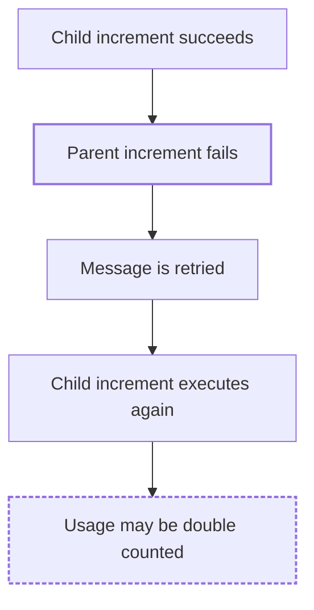

# FaultScout

> Discover how your software system can fail.

[](#installation)
[](#roadmap)
[](LICENSE)

## What is FaultScout?

FaultScout is a **Claude Code plugin** for evidence-based, **read-only
reliability analysis**. You open Claude Code inside a repository, run one
command, and FaultScout reads the code, reconstructs the architecture and
critical flows, finds the boundaries where things can break, and reports
**repository-specific failure scenarios** — each tied to real files,
functions, and configuration, with a clear statement of how strong the
evidence is.

It is not generic reliability advice. If the evidence is not in the
repository, FaultScout says so instead of guessing.

FaultScout does **not** run your system, inject failures, or touch
infrastructure. Every scenario is a static hypothesis, never a runtime
result.

## Installation

FaultScout is distributed through the Claude Code plugin system. The
repository is its own plugin marketplace, so it installs straight from GitHub.

Inside Claude Code:

```text
/plugin marketplace add furkandeveloper/fault-scout
/plugin install faultscout@faultscout
```

Or from your shell:

```bash
claude plugin marketplace add furkandeveloper/fault-scout
claude plugin install faultscout@faultscout
```

Restart Claude Code (or start a new session) after installing. To update
later:

```text
/plugin marketplace update faultscout
/plugin update faultscout@faultscout
```

### GitHub install vs local development

| | GitHub install | Local development |
|---|---|---|
| How | `marketplace add` + `plugin install` | `claude --plugin-dir /path/to/fault-scout` |
| Where the files live | Copied into Claude Code's plugin cache | Read from your checkout on every start |
| Edits to the plugin | Need `plugin update` | Take effect on the next session |
| Scope | Persists across sessions (user scope by default) | Only the session started with the flag |
| For | Using FaultScout | Working on FaultScout |

The command name is the same in both cases.

## Usage

Open Claude Code in the repository you want to analyze and run:

```text
/faultscout:analyze
```

The report is written in English by default. To get it in another supported
language, pass `language=`:

```text
/faultscout:analyze language=turkish
```

Claude then:

1. Discovers the repository: languages, services and modules, entry points,
   dependencies, configuration, databases, caches, brokers, external APIs,
   workers, scheduled jobs, infrastructure, and CI/CD files.
2. Reconstructs the architecture and the critical flows from the code.
3. Locates failure boundaries and catalogues the resilience mechanisms that
   already exist.
4. Generates candidate failure scenarios, merges the ones that share a root
   cause, and ranks the strongest by evidence quality.
5. Self-checks the draft for invented evidence, unhedged claims, duplicated
   scenarios, and format drift.
6. Prints a **FaultScout Analysis Report** in the chat.

The analysis is **read-only**. FaultScout never modifies the analyzed
repository, never runs the project or its tests, and never starts, stops, or
disrupts any process, container, or service.

### Report language

```text
/faultscout:analyze                     English (default)
/faultscout:analyze language=english    English
/faultscout:analyze language=turkish    Turkish
```

The language changes only the human-readable part of the report: headings,
labels, scenario prose, propagation chains, and Mermaid node labels.
Anything taken from your repository — file paths, function and class names,
configuration keys, queue/table/key names, log messages, code snippets — is
never translated. Translation never changes the evidence, the certainty
level, the hedging, or the confidence value.

An unsupported value stops before any analysis:

```text
/faultscout:analyze language=spanish

Unsupported language: spanish.
Supported languages: english, turkish.
```

## What it analyzes

Failure classes FaultScout looks for, only where the repository supports
them:

- dependency outages (database, cache, broker, external API, internal service)
- timeouts — missing, unbounded, or mismatched across a call chain
- retries and retry storms
- missing resilience safeguards (circuit breakers, bulkheads, fallbacks, rate limits)
- partial writes and non-transactional multi-step updates
- stale cache
- race conditions
- duplicate processing and idempotency gaps
- event delivery failures (publish-after-commit gaps, ack ordering, dead letters)
- startup failures
- resource exhaustion (pools, queues, threads, memory)
- recovery problems (reconnects, poison messages, graceful shutdown)

## Output

Every report has the same nine sections:

```text
# FaultScout Analysis Report
## 1. Executive Summary
## 2. Repository Overview
## 3. Architecture and Critical Flows
## 4. Failure Scenarios
## 5. Failure Propagation Paths
## 6. Existing Resilience Mechanisms
## 7. Potential Reliability Gaps
## 8. Recommended Follow-Up Actions
## 9. Evidence and Limitations
```

Each failure scenario contains: title, summary, trigger condition, affected
component, evidence (file paths, function/method/class/config references,
line ranges when they were actually read), failure mechanism, failure
propagation path, potential consequences, existing mitigations, missing or
questionable mitigations, static confidence, suggested follow-up, and
evidence limitations.

### Three levels of certainty

Every claim is labelled so you know how much to trust it:

| Level | Phrase |
|---|---|
| Directly observed | "The code directly shows..." |
| Strongly supported inference | "This suggests..." |
| Plausible but unverified | "A possible failure mode is..." / "The repository does not provide enough evidence to confirm..." |

### Confidence

Confidence describes the **quality of the static evidence** — not the
probability that a failure occurs, and not its severity.

| Level | Meaning |
|---|---|
| HIGH | Directly supported by clear code or configuration evidence |
| MEDIUM | Strongly plausible and supported by multiple pieces of evidence, but runtime behavior is unknown |
| LOW | Possible, but repository evidence is insufficient |

### Diagrams

The report uses Mermaid diagrams only when they clarify an evidence-supported
relationship — a service dependency graph, a request lifecycle, a data
consistency flow, an event processing flow, or a failure propagation flow
with a branch, join, or loop. Every node and edge in a diagram is backed by a
file Claude read; nothing is added from general knowledge about "systems
like this". Diagrams render in any Markdown viewer with Mermaid support.

Illustrative propagation diagram (not real output):



## Analysis boundaries

FaultScout is deliberately limited to static analysis:

- read-only analysis of the target repository; no source-code modifications
- no runtime execution, no failure injection, no container or network
  manipulation, no production or external-system access
- no runtime validation: nothing in a report is tested, reproduced, or
  confirmed
- no invented evidence, and no assumption that an unobserved failure is
  impossible or that a missing safeguard automatically proves a bug

The analysis stays useful when the repository cannot be run locally, has no
Compose file, has unavailable dependencies or incomplete configuration, or
is only one part of a larger system — the report states what it could and
could not see.

## Limitations

- The analysis is only as good as the repository evidence. Behavior that
  lives outside the repository (managed services, infrastructure config,
  runtime settings) is not visible to it.
- Every scenario is a **hypothesis** derived from static evidence. Confirming
  it requires tests or experiments that are outside FaultScout's scope.
- Line ranges are cited only when Claude actually read those lines; other
  references use the file and symbol only.

## Development

Clone the repository and validate the plugin:

```bash
git clone https://github.com/furkandeveloper/fault-scout.git
cd fault-scout
claude plugin validate .
```

Run Claude Code with the local checkout loaded as a plugin, inside any
repository you want to analyze:

```bash
cd /path/to/some/project
claude --plugin-dir /path/to/fault-scout
```

Then run `/faultscout:analyze` as usual. Changes to command or skill files
take effect on the next session.

The plugin has no build step, no dependencies, no server, and no runtime
code. It consists of:

```text
.claude-plugin/plugin.json        plugin manifest
.claude-plugin/marketplace.json   marketplace manifest (lets the repo install from GitHub)
commands/analyze.md               the /faultscout:analyze command (parses language=)
skills/faultscout/SKILL.md        how Claude discovers, reasons about, and reports failure scenarios
CLAUDE.md                         development specification (not loaded by the plugin)
```

`CLAUDE.md` is the specification used while developing FaultScout. It is not
part of the plugin's runtime context; everything the plugin sends to Claude
comes from `commands/` and `skills/`.

## Roadmap

FaultScout stays analysis-only. Planned work improves the depth and
usability of the analysis, not its reach into running systems.

- **0.3** — Analysis-only plugin: `/faultscout:analyze`, the `faultscout`
  skill, nine-section report, three certainty levels, static confidence
  (this release)
- **Next** — scoped analysis (`/faultscout:analyze` on a path, service, or
  flow); optional report-to-file on request; more report languages
- **Later** — pull-request analysis in CI: a read-only report on how a change
  affects the failure scenarios of the system

## Author

[furkandeveloper](https://github.com/furkandeveloper)

Issues and pull requests: <https://github.com/furkandeveloper/fault-scout>

## License

MIT — see [LICENSE](LICENSE).
