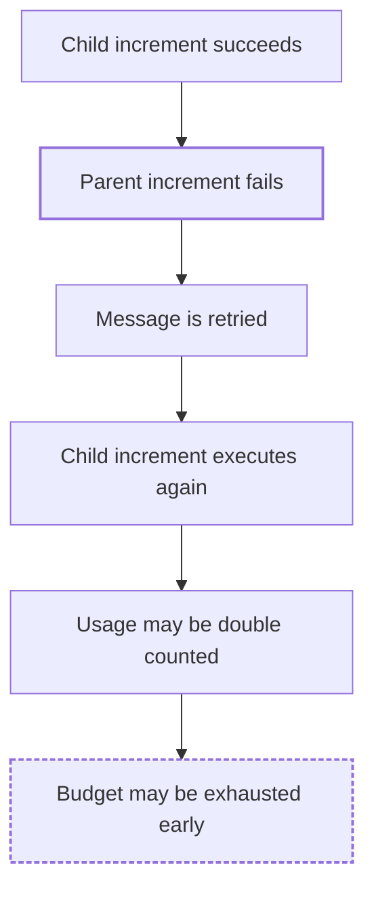

# FaultScout

> Discover how your software system can fail.

[](#installation)
[](#limitations)
[](LICENSE)

## What is FaultScout?

FaultScout is a **Claude Code plugin** for reliability and chaos engineering.
It is a **read-only reliability analysis tool** and a **chaos engineering
analysis assistant**: you open Claude Code inside a repository, run one
command, and FaultScout reads the code, builds a model of the architecture,
finds the boundaries where things can break, and reports the five strongest
**repository-specific, evidence-backed failure scenarios**, each with a
failure propagation chain and a suggested experiment.

It is not generic chaos-engineering advice. Every scenario points at real
files, functions, and flows in your repository. If the evidence is not there,
FaultScout says so instead of guessing.

FaultScout does **not** inject failures at runtime. It produces hypotheses
about how the system could fail, not confirmed results.

## Installation

FaultScout is distributed through the Claude Code plugin system. The
repository is its own plugin marketplace, so it installs straight from GitHub.

Inside Claude Code:

```text
/plugin marketplace add furkandeveloper/fault-scout
/plugin install faultscout@faultscout
```

Or from your shell:

```bash
claude plugin marketplace add furkandeveloper/fault-scout
claude plugin install faultscout@faultscout
```

Restart Claude Code (or start a new session) after installing. To update
later:

```text
/plugin marketplace update faultscout
/plugin update faultscout@faultscout
```

### GitHub install vs local development

| | GitHub install | Local development |
|---|---|---|
| How | `marketplace add` + `plugin install` | `claude --plugin-dir /path/to/fault-scout` |
| Where the files live | Copied into Claude Code's plugin cache | Read from your checkout on every start |
| Edits to the plugin | Need `plugin update` | Take effect on the next session |
| Scope | Persists across sessions (user scope by default) | Only the session started with the flag |
| For | Using FaultScout | Working on FaultScout |

The command name is the same in both cases.

## Usage

Open Claude Code in the repository you want to analyze and run:

```text
/faultscout:chaos
```

Claude then:

1. Inspects the repository: languages, entry points, dependencies, config,
   Docker/infra files, databases, caches, brokers, workers, scheduled jobs,
   external APIs, tests, retries, timeouts, transactions.
2. Builds a lightweight architecture model.
3. Traces the business-critical flows and identifies failure boundaries.
4. Generates candidate failure hypotheses, merges the ones that share a root
   cause, and selects the five strongest across different failure classes.
5. Self-checks the draft for duplicated sections, broken text, and format
   drift.
6. Prints a **FaultScout Report** in the chat.

The analysis is **read-only**. FaultScout does not modify your repository,
change configuration, or start, stop, or disrupt any process or service.

## What it analyzes

- architecture and component boundaries
- data flows and business-critical request paths
- queues, message brokers, producers, and consumers
- caches
- databases and transactions
- retries, timeouts, and circuit breakers
- idempotency of side effects
- failure handling and partial failures
- consistency (stale state, eventual consistency, races)
- external dependencies and outbound calls

## Output

The report always has the same structure:

```text
System Overview
        ↓
Architecture Diagram
        ↓
Failure Scenarios
        ↓
Evidence
        ↓
Failure Propagation
        ↓
Impact
        ↓
Suggested Experiment
```

In Markdown terms: a `# FaultScout Report` with `## Repository`,
`## Architecture` (summary plus a Mermaid diagram of the normal flow),
`## Failure Scenarios` with five numbered scenarios, and a `## Summary`.
Each scenario has exactly these sections, in this order:

- **Failure Type** — the failure class (e.g. Messaging / Idempotency)
- **Evidence** — files and symbols observed in the code, and what they do or
  do not contain
- **Failure Condition** — the abnormal condition that triggers the scenario
- **Failure Propagation** — a step chain from failure to consequence, plus a
  Mermaid diagram when it helps (a branch, a join, a retry loop, or a long
  chain)
- **Potential Consequence** — what the user or business may observe
- **How It Could Be Tested Later** — a concrete future chaos experiment
- **Confidence** — High / Medium / Low, describing how well the evidence
  supports the analysis (not severity)

Evidence sections contain facts. Everything after them is a hypothesis
derived from those facts. Diagrams render in any Markdown viewer with Mermaid
support (GitHub, most editors); no extra tooling is needed.

## Example

A failure propagation diagram from a scenario might look like this:

Potential failure propagation:



This is only an illustration. Real FaultScout output is generated from the
evidence in your repository: the components, connections, and propagation
steps come from files Claude actually read, and nothing is added from general
knowledge about "systems like this".

## Limitations

- **v0.1.2 is read-only.** It reads and reasons; it changes nothing.
- It does **not** inject failures into a running system.
- It does **not** touch production systems or infrastructure.
- The analysis is only as good as the repository evidence. Behavior that lives
  outside the repository (infrastructure config, managed services, runtime
  settings) is not visible to it.
- Every failure scenario is a **hypothesis**, not a confirmed failure. Treat
  the report as a prioritized list of things to verify.
- Suggested experiments are descriptions for a future chaos test. They are
  not executed automatically.

## Development

Clone the repository and validate the plugin:

```bash
git clone https://github.com/furkandeveloper/fault-scout.git
cd fault-scout
claude plugin validate .
```

Run Claude Code with the local checkout loaded as a plugin, inside any
repository you want to analyze:

```bash
cd /path/to/some/project
claude --plugin-dir /path/to/fault-scout
```

Then run `/faultscout:chaos` as usual. Changes to the command or skill files
take effect on the next session.

The plugin has no build step and no dependencies. It consists of:

```text
.claude-plugin/plugin.json        plugin manifest
.claude-plugin/marketplace.json   marketplace manifest (lets the repo install from GitHub)
commands/chaos.md                 the /faultscout:chaos command
skills/chaos-analysis/SKILL.md    how Claude reasons about failures
CLAUDE.md                         development specification (not loaded by the plugin)
```

`CLAUDE.md` is the specification used while developing FaultScout. It is not
part of the plugin's runtime context; everything the plugin sends to Claude
comes from `commands/` and `skills/`.

## Roadmap

- **0.1** — Repository analysis and report
- **0.1.1** — Deterministic report structure, failure propagation chains,
  root-cause deduplication, output self-check
- **0.1.2** — Mermaid architecture and failure propagation diagrams (this
  release)
- **0.2** — Generate executable test scenarios
- **0.3** — FaultScout MCP server
- **0.4** — Controlled local Docker failure injection
- **0.5** — Execute chaos experiments and observe results
- **1.0** — CI integration: scenarios and regressions reported on pull requests

## Author

[furkandeveloper](https://github.com/furkandeveloper)

Issues and pull requests: <https://github.com/furkandeveloper/fault-scout>

## License

MIT — see [LICENSE](LICENSE).
