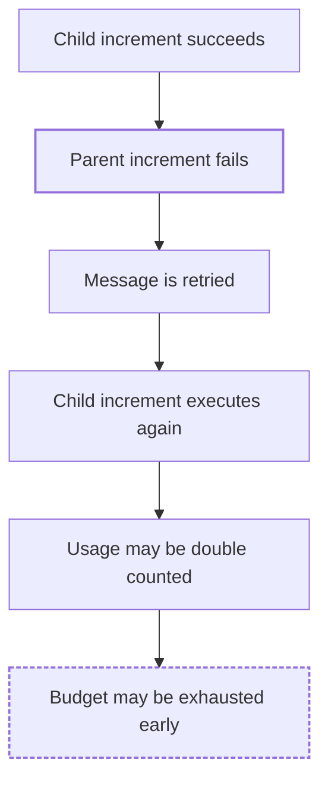

# FaultScout

> Discover how your software system can fail.

[](#installation)
[](#limitations)
[](LICENSE)

## What is FaultScout?

FaultScout is a **Claude Code plugin** for reliability and chaos engineering.
It is a **read-only reliability analysis tool** and a **chaos engineering
analysis assistant**: you open Claude Code inside a repository, run one
command, and FaultScout reads the code, builds a model of the architecture,
finds the boundaries where things can break, and reports the five strongest
**repository-specific, evidence-backed failure scenarios**, each with a
failure propagation chain and a suggested experiment.

It is not generic chaos-engineering advice. Every scenario points at real
files, functions, and flows in your repository. If the evidence is not there,
FaultScout says so instead of guessing.

FaultScout does **not** inject failures at runtime. It produces hypotheses
about how the system could fail, not confirmed results.

## Installation

FaultScout is distributed through the Claude Code plugin system. The
repository is its own plugin marketplace, so it installs straight from GitHub.

Inside Claude Code:

```text
/plugin marketplace add furkandeveloper/fault-scout
/plugin install faultscout@faultscout
```

Or from your shell:

```bash
claude plugin marketplace add furkandeveloper/fault-scout
claude plugin install faultscout@faultscout
```

Restart Claude Code (or start a new session) after installing. To update
later:

```text
/plugin marketplace update faultscout
/plugin update faultscout@faultscout
```

### GitHub install vs local development

| | GitHub install | Local development |
|---|---|---|
| How | `marketplace add` + `plugin install` | `claude --plugin-dir /path/to/fault-scout` |
| Where the files live | Copied into Claude Code's plugin cache | Read from your checkout on every start |
| Edits to the plugin | Need `plugin update` | Take effect on the next session |
| Scope | Persists across sessions (user scope by default) | Only the session started with the flag |
| For | Using FaultScout | Working on FaultScout |

The command name is the same in both cases.

## Usage

Open Claude Code in the repository you want to analyze and run:

```text
/faultscout:chaos
```

The report is written in English by default. To get it in another supported
language, pass `language=`:

```text
/faultscout:chaos language=turkish
```

Claude then:

1. Inspects the repository: languages, entry points, dependencies, config,
   Docker/infra files, databases, caches, brokers, workers, scheduled jobs,
   external APIs, tests, retries, timeouts, transactions.
2. Builds a lightweight architecture model.
3. Traces the business-critical flows and identifies failure boundaries.
4. Generates candidate failure hypotheses, merges the ones that share a root
   cause, and selects the five strongest across different failure classes.
5. Self-checks the draft for duplicated sections, broken text, and format
   drift.
6. Prints a **FaultScout Report** in the chat.

The analysis is **read-only**. FaultScout does not modify your repository,
change configuration, or start, stop, or disrupt any process or service.

### Report language

```text
/faultscout:chaos                     English (default)
/faultscout:chaos language=english    English
/faultscout:chaos language=turkish    Turkish
```

| | |
|---|---|
| Default language | English |
| Supported | English, Turkish |

The language changes only the human-readable part of the report: title,
headings, scenario descriptions, evidence explanations, propagation chains,
consequences, suggested experiments, the summary, and Mermaid node labels.
For example, in Turkish `## Failure Scenarios` becomes `## Hata Senaryoları`
and `**Failure Propagation:**` becomes `**Hata Yayılımı:**`.

Anything taken from your repository is never translated: file paths,
function/type/variable names, config keys, queue/topic/table/cache key names,
log messages, and code snippets stay exactly as they appear in the code.
Translation does not change the technical meaning of the evidence, the
fact/hypothesis distinction ("may grow" stays "büyüyebilir", not "büyür"),
the confidence levels, or the Mermaid structure.

An unsupported value stops before any analysis:

```text
/faultscout:chaos language=spanish

Unsupported language: spanish.
Supported languages: english, turkish.
```

## What it analyzes

- architecture and component boundaries
- data flows and business-critical request paths
- queues, message brokers, producers, and consumers
- caches
- databases and transactions
- retries, timeouts, and circuit breakers
- idempotency of side effects
- failure handling and partial failures
- consistency (stale state, eventual consistency, races)
- external dependencies and outbound calls

## Output

The report always has the same structure:

```text
System Overview
        ↓
Architecture Diagram
        ↓
Failure Scenarios
        ↓
Evidence
        ↓
Failure Propagation
        ↓
Impact
        ↓
Suggested Experiment
```

In Markdown terms: a `# FaultScout Report` with `## Repository`,
`## Architecture` (summary plus a Mermaid diagram of the normal flow),
`## Failure Scenarios` with five numbered scenarios, and a `## Summary`.
Each scenario has exactly these sections, in this order:

- **Failure Type** — the failure class (e.g. Messaging / Idempotency)
- **Evidence** — files and symbols observed in the code, and what they do or
  do not contain
- **Failure Condition** — the abnormal condition that triggers the scenario
- **Failure Propagation** — a step chain from failure to consequence, plus a
  Mermaid diagram when it helps (a branch, a join, a retry loop, or a long
  chain)
- **Potential Consequence** — what the user or business may observe
- **How It Could Be Tested Later** — a concrete future chaos experiment
- **Confidence** — High / Medium / Low, describing how well the evidence
  supports the analysis (not severity)

Evidence sections contain facts. Everything after them is a hypothesis
derived from those facts. Diagrams render in any Markdown viewer with Mermaid
support (GitHub, most editors); no extra tooling is needed.

## Example

A failure propagation diagram from a scenario might look like this:

Potential failure propagation:



This is only an illustration. Real FaultScout output is generated from the
evidence in your repository: the components, connections, and propagation
steps come from files Claude actually read, and nothing is added from general
knowledge about "systems like this".

## Experiment execution (v0.2)

v0.2 turns a failure scenario into a real, but tightly scoped, runtime
experiment against your **local Docker Compose environment** — no MCP
server, no backend, no daemon. Claude Code's own terminal access is the
entire runtime interface.

The flow:

```text
Analyze (/faultscout:chaos)
        ↓
Choose a scenario
        ↓
Plan the experiment (target, failure mode, expected signal, restore steps)
        ↓
You explicitly approve execution
        ↓
Docker Compose experiment (snapshot → inject → observe → restore → verify)
        ↓
Experiment Report
```

Run `/faultscout:experiment` (optionally `/faultscout:experiment 3` to pick
scenario 3 directly) — see the `chaos-experiment` skill and
`commands/experiment.md`. Supported failure modes are exactly:

- **`container.pause`** — pause and later unpause a Compose service's
  container.
- **`container.network_disconnect`** — disconnect and later reconnect a
  container from a specific Compose-managed network.
- **`redis.poison_key`** — overwrite a specific Redis key and later restore
  its exact original value (or delete it, if it did not previously exist).

Guarantees:

- **FaultScout never modifies your codebase.** No source file, Dockerfile,
  Compose file, or configuration file is ever edited to run an experiment.
  If a scenario would require a code change to test, FaultScout says so and
  stops instead.
- **Nothing is mutated without your explicit approval of the printed plan.**
  Selecting a scenario is not approval to execute it.
- **Local Docker Compose only.** Experiments never target Kubernetes,
  staging, production, cloud infrastructure, or a remote Docker daemon.
- **Every experiment that injects a failure restores it**, and verifies the
  restoration instead of assuming the restore command succeeded. If restore
  fails, FaultScout says so plainly and gives the exact manual fix.
- **No generic command execution.** Only the commands each supported failure
  mode actually needs (`docker compose pause/unpause`, `docker network
  disconnect/connect`, a single planned `redis-cli` operation, plus
  read-only inspection and observation commands) — never `docker compose
  down`, `docker system prune`, `docker rm`, `docker kill`, `docker stop`,
  `docker volume rm`, or `docker network rm`.

## Limitations

- **Chaos analysis (`/faultscout:chaos`) is read-only.** It reads and
  reasons; it changes nothing in your repository or your running system.
- **Experiment execution (`/faultscout:experiment`) can mutate your local
  Docker Compose environment**, but only after you explicitly approve a
  printed plan, only using one of the three supported failure modes, and
  always followed by a verified restore. It never modifies your repository.
- Neither command touches production systems or infrastructure.
- The analysis is only as good as the repository evidence. Behavior that lives
  outside the repository (infrastructure config, managed services, runtime
  settings) is not visible to it.
- Every failure scenario is a **hypothesis**, not a confirmed failure, until
  an experiment result says `CONFIRMED` or `PARTIALLY_CONFIRMED` with
  concrete evidence.
- Restoring the injected infrastructure state does not necessarily undo
  application-level business side effects that occurred while the failure
  was active; the experiment report calls this out explicitly when it
  applies.

## Development

Clone the repository and validate the plugin:

```bash
git clone https://github.com/furkandeveloper/fault-scout.git
cd fault-scout
claude plugin validate .
```

Run Claude Code with the local checkout loaded as a plugin, inside any
repository you want to analyze:

```bash
cd /path/to/some/project
claude --plugin-dir /path/to/fault-scout
```

Then run `/faultscout:chaos` or `/faultscout:experiment` as usual. Changes to
command or skill files take effect on the next session.

The commands and skills have no build step and no dependencies. There is no
server, backend, or daemon of any kind — the experiment engine is the
`chaos-experiment` skill itself, driving Claude Code's terminal directly.
The plugin consists of:

```text
.claude-plugin/plugin.json        plugin manifest
.claude-plugin/marketplace.json   marketplace manifest (lets the repo install from GitHub)
commands/chaos.md                 the /faultscout:chaos command (parses language=)
commands/experiment.md            the /faultscout:experiment command (approval-gated execution)
skills/chaos-analysis/SKILL.md    how Claude reasons about failures and writes the report
skills/chaos-experiment/SKILL.md  how Claude plans and safely executes a chosen experiment
CLAUDE.md                         development specification (not loaded by the plugin)
```

`CLAUDE.md` is the specification used while developing FaultScout. It is not
part of the plugin's runtime context; everything the plugin sends to Claude
comes from `commands/` and `skills/`.

## Roadmap

- **0.1** — Repository analysis and report
- **0.1.1** — Deterministic report structure, failure propagation chains,
  root-cause deduplication, output self-check
- **0.1.2** — Mermaid architecture and failure propagation diagrams
- **0.1.3** — Report language selection (`language=english|turkish`)
- **0.2** — `/faultscout:experiment`: turn a scenario into an approved,
  evidence-backed experiment plan and execute it directly through Claude
  Code's terminal against local Docker Compose (`container.pause`,
  `container.network_disconnect`, `redis.poison_key`), with mandatory
  snapshot/restore/verify and an evidence-backed result (this release)
- **1.0** — CI integration: scenarios and regressions reported on pull requests

## Author

[furkandeveloper](https://github.com/furkandeveloper)

Issues and pull requests: <https://github.com/furkandeveloper/fault-scout>

## License

MIT — see [LICENSE](LICENSE).
